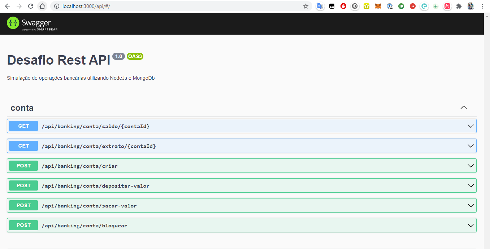

# Desafio Api REST

Esta é uma API ilustrativa que foi implementada como uma forma de demonstrar em termos gerais qual é o meu estilo de desenvolvimento no presente momento. 


##Tabela de Conteúdos
<!-- START doctoc generated TOC please keep comment here to allow auto update -->
<!-- DON'T EDIT THIS SECTION, INSTEAD RE-RUN doctoc TO UPDATE -->

- [Instruções de uso](#instru%C3%A7%C3%B5es-de-uso)
    - [Instalação](#instala%C3%A7%C3%A3o)
      - [Observações sobre o banco de dados](#observa%C3%A7%C3%B5es-sobre-o-banco-de-dados)
    - [Uso da API](#uso-da-api)
- [Sobre a arquitetura escolhida](#sobre-a-arquitetura-escolhida)
    - [Camada de API ( Presentation Layer )](#camada-de-api--presentation-layer-)
    - [Camada de Serviços ( Business Logic Layer )](#camada-de-servi%C3%A7os--business-logic-layer-)
    - [Camada de Repositórios ( Persistence Layer)](#camada-de-reposit%C3%B3rios--persistence-layer)
- [Sobre as tecnologias escolhidas](#sobre-as-tecnologias-escolhidas)
    - [Validação de dados nos controllers](#valida%C3%A7%C3%A3o-de-dados-nos-controllers)
    - [Validação de dados nos Serviços](#valida%C3%A7%C3%A3o-de-dados-nos-servi%C3%A7os)
- [Testes](#testes)
- [Estrutura de arquivos](#estrutura-de-arquivos)

<!-- END doctoc generated TOC please keep comment here to allow auto update -->

# Instruções de uso

### Instalação

Para rodar este projeto em seu computador será necessário instalar a versão LTS do Node, encontrada [neste link](https://nodejs.org/en/download/), e em seguida executar os seguintes comandos em seu terminal:


```bash
git clone https://github.com/PimentelM/desafio-dev-api-rest
cd ./desafio-dev-api-rest
npm install --global yarn
yarn install
yarn start
```

Caso prefira utilizar a versão em docker, basta ter em seu computador o Docker instalado e rodar o comando `docker-compose up` na pasta do projeto


```bash
git clone https://github.com/PimentelM/desafio-dev-api-rest
cd ./desafio-dev-api-rest
docker-compose up
```
No final do proesso, será disponibilizo um servidor HTTP na porta `3000` do `localhost`.


#### Observações sobre o banco de dados
Caso deseje especificar a string de conexão com o banco de dados, utilize a variável de ambiente `db_conn` seguindo o modelo presente no .env.example. 

Caso a string de conexão não seja especificada o sistema utilizará uma instância in-memory do banco de dados ou a instância provida pelo docker-compose caso ele seja utilizado.
 
### Uso da API

Você poderá utilizar esta API através do painel de requisições disponibilizado pelo `Swagger` ou um client HTTP de sua preferência.

Todas as especificações referentes à API estarão disponíveis no painel do `Swagger` uma vez que a API estiver rodando.



O Painel poderá ser acessado através da seguinte URL: `http://localhost:3000/api`

---

# Sobre a arquitetura escolhida

O sistema está organizado em uma estrutura que favorece bastante a manutenção e estruturação de aplicações monolíticas, onde o código e os diferentes componentes do sistema podem ser reutilizados ou modificados com facilidade.

Considerei fazer a API utilizando apenas o Express.js, porém esta seria minha escolha caso fosse criar um microsserviço, visto que são sistemas menores. Por outro lado, quando se trata de aplicações monolíticas estas tendem a crescer bastante e mais estrutura de código é necessária.

Dividi o sistema em três camadas principais que serão descritas à seguir.

> ### Nota do autor
> Neste momento do desenvolvimento eu me reuniria com o time para avaliar a necessidade de refatorar o código com o padrão de design de repositórios para fazer a implementação de testes unitários, já que estes requerem uma camada de abstração entre os serviços e o banco de dados para serem feitos.
> 
> O sistema é modular, então nem todos os módulos precisariam seguir à risca a ideia de abstrair o acesso aos models, já que a implementação de um módulo não interfere na implementação de outro.

### Camada de API ( Presentation Layer )

Nesta camada, utilizaremos controllers para:
* Lidar com as requisições HTTP, traduzindo-as em diferentes campos acessíveis pelos métodos do controller.
* Tratar e validar o input do usuário antes de passar para os serviços
* Devolver a resposta no formato apropriado
* Responder com erros apropriados caso o servidor não lide bem com o input do usuário ou caso ele seja inválido.

Todas as requisições que fazem algum tipo de alteração no estado da aplicação, ou no banco de dados, utilizarão o método `POST`, enquanto todas as requisições de consulta utilizarão o método `GET`

### Camada de Serviços ( Business Logic Layer )

Toda a lógica da aplicação será feita na camada de serviços, os serviços possuem acesso à outros providers através do sistema de injeção de dependencias do NestJS.

### Camada de Repositórios ( Persistence Layer)

Usamos esta camada para abstrair o acesso ao banco de dados através de um padrão de design chamado "Repositório". Onde poderemos escrever testes unitários para as regras de negócio dos serviços sem termos que instanciar o banco de dados.

O acesso ao banco de dados será disponibilizado através de models que serão injetados nos repositórios sob demanda. Os models são representações das entidades e todas as queries e operações relacionadas ao banco de dados podem ser feitas através deles.


# Sobre as tecnologias escolhidas

Com a intenção de trabalhar com tecnologias que se integram de forma bastante harmônica, utilizaremos a seguinte stack em nosso projeto:

* MongoDB: Banco de dados NoSQL orientado a objetos.
* NestJS: Este é o nosso robusto framework arquitetural para NodeJS.
* Jest: Biblioteca de testes automatizados em Javascript / Typescript.
* Typescript: Linguagem de escolha para o projeto, por possuir suporte à tipagem estática.

O framework escolhido oferece suporte à diversos design patterns, sendo o design pattern mais notável o uso de serviços como abstrações dos diferentes componentes lógicos do sistema.


### Validação de dados nos controllers

Faremos a validação do tipo do dado e da presença de campos obrigatórios.

Utilizaremos a biblioteca `class-validator`  e o recurso de `Pipes` do NestJs para validar o input em nossos controllers.

Requisições com corpo da requisição terão seus dados validados por "validators" definidos em um arquivo separado, eles utilizam os recursos da biblioteca `class-validator` e um pipe de validação global para validadores de classe.

Retornaremos um erro `400 Bad Request` na requisição quando um input não estiver no formato correto.

Class validators serão utilizados para o corpo da requisição em requisições HTTP do tipo `POST`, e Pipes de validação serão utilizados para parâmetros e queries.


### Validação de dados nos serviços

Por ser uma verificação de regra de negócio, a verificação será feita com código, tradicionalmente, e sempre que algum input for inválido, lançaremos uma Exceção que será captada pelo NestJs e uma resposta apropriada será enviada ao usuário.

Por via de regra usaremos a exceção associada ao código de status HTTP "BadRequest", que já possui um handler nativo do Nest, mas caso seja necessário abstrair totalmente algum serviço da camada de API então a classe do erro seria substituida por uma classe agnóstica e um handler para ela seria criada.


# Testes

Dado o escopo do projeto, criaremos testes end to end para validar os principais pontos da aplicação e alguns testes unitários para ilustrar como seria feita a implementação deles.

A cobertura dos testes não é 100% e nem cobre todos os casos possíveis, o intúito aqui é ilustrar a implementação de diferentes tipos de testes para registro do estilo de desenvolvimento.

Os testes podem ser encontrados ao lado de seus respectivos controllers // serviços, tendo a seguinte convenção de nomeclatura:

`.e2e.ts`: Testes de integração

`.spec.ts`: Testes unitários


> ## Nota do desenvolvedor:
> 
> Testes automatizados são a àrea de desenvolvimento onde mais tenho curiosidade para aprender sobre como eles são utilizados em equipes que conseguiram levar isso ao estado da arte, pois caso sigamos à risca a ideia de criar testes unitários para todos os componentes do nosso sistema acabamos corredo o risco de engessar o sistema e gerar muito overhead no desenvolvimento, e por outro lado, testes são ferramentas muito úteis que podem ser inclusive usadas para documentar o funcionamento do sistema, especificar requisitos e garantir que o código terá algo contra o qual será testado antes mesmo de começarmos a escreve-lo ( Caso usemos testes na prática de TDD ). 
> Acredito que é uma arte que vale a pena ser masterizada e neste projeto refleti apenas o meu estado atual de entendimento sobre o assunto, que está em desenvolvimento.
> 


# Deploy

A maioria dos provedores de cloud modernos, como Digital Ocean, Google Cloud e AWS oferecem um tipo de serviço onde você compra uma instância de uma máquina virtual / container e pode configura-la com uma determinada imagem e diferentes parâmtros.
 

Dado que a topologia do nosso sistema constitui-se de dois principais elementos, sendo eles o servidor NestJs e o banco de dados, poderiamos alugar uma instância para cada um destes elementos e fazer o deploy de acordo com os procedimentos de cada provedor de cloud.

O banco de dados seria o mais simples, pois após a configuração dos parâmetros desejados poderiamos obter a string de conexão e pouca interação com o provedor cloud precisaria ser feita dali em diante, já que poderiamos monitorar o banco usando ferramentas que se conectam de forma externa.

Por outro lado, se tratando do servidor da API, dado que se trata de um sistema que provavelmente estará em constante pudanca, precisariamos também procurar por soluções que nos oferececem alguns recursos como suporte à integração contínua / entrega contínua ( para que póssamos fazer o deploy de versões atualizadas do sistema com apenas um push em uma branch ), e também recursos que nos permitam uma maior visibilidade do que acontece com a instância à nível de recursos, rede e de camada de aplicação, ou seja, uma plataforma com monitoramento de tempo de resposta, uso de memória, uso de processador, e etc, tendo assim uma boa visibilidade do estado da aplicação.


# Estrutura de arquivos

O sistema tem a seguinte organização:

* **./**: Onde ficam os arquivos de configuração principais das tecnologias utilizadas.

* **./doc**: Aqui teremos alguns arquivos de documentação interna à respeito das especificações e requisitos do projeto.

* **./src**: Código fonte do projeto

  * **./models**: As definições de esquema do banco de dados

  * **./modules**: Onde ficam os módulos do sistema.
    * **./database**: Módulo que carrega e executa tarefas associadas ao banco de dados

    * **./banking**: Módulo onde fica o código responsável pela API do sistema de gestão de contas

  * **./pipes**: Onde definimos pipes de validação e transformação

  * **./main.ts**: Entrypoint do projeto

  * **./config.ts**: Arquivo onde podem ser agregadas as variáveis de ambiente

